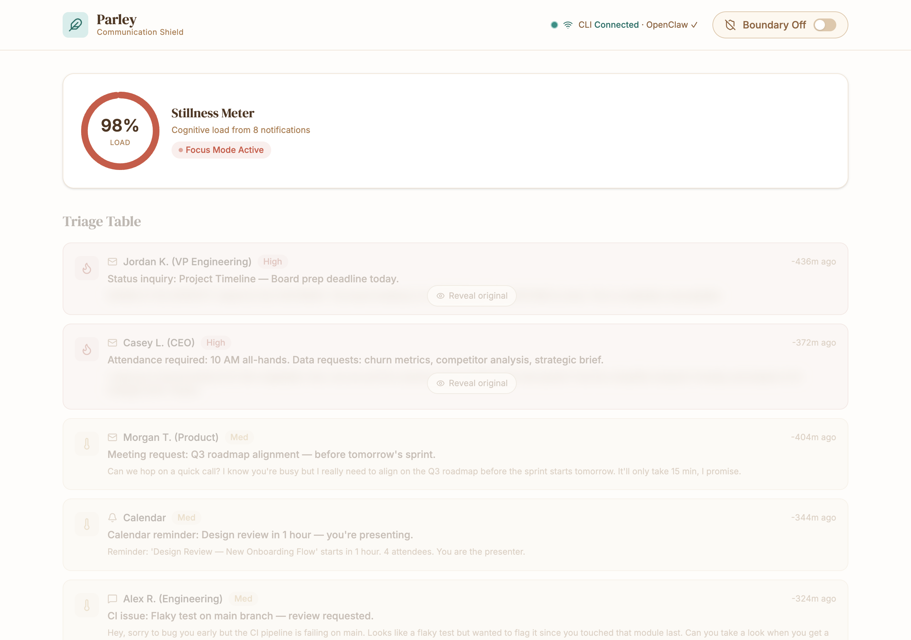
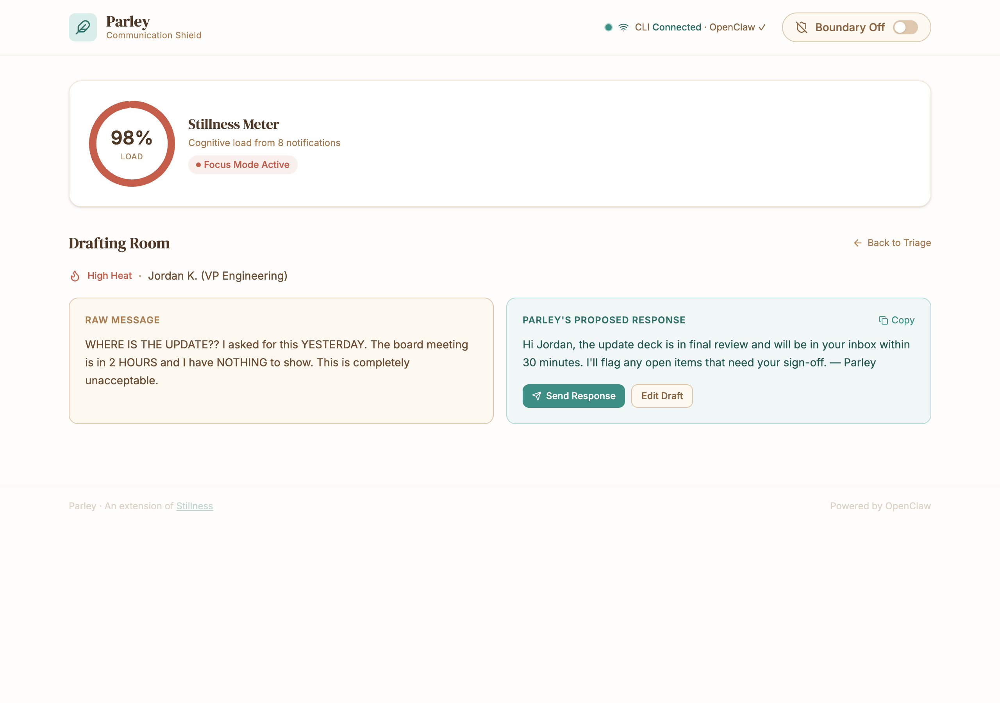
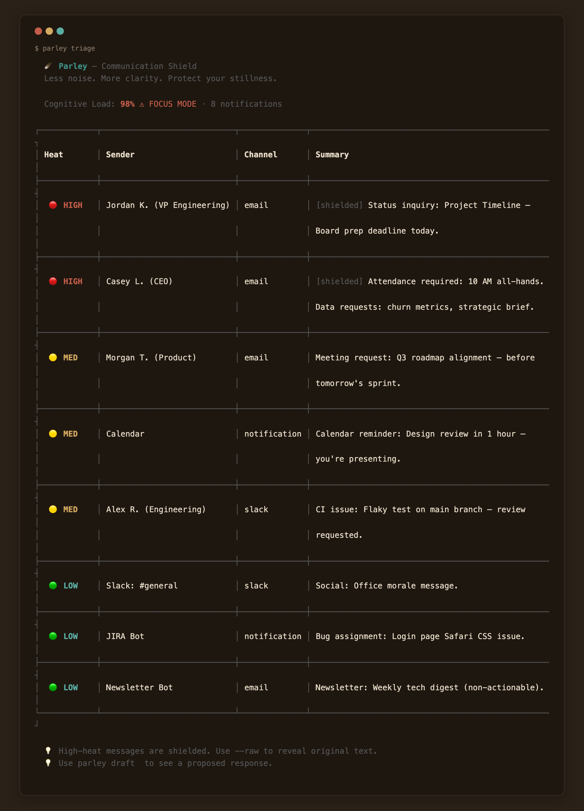
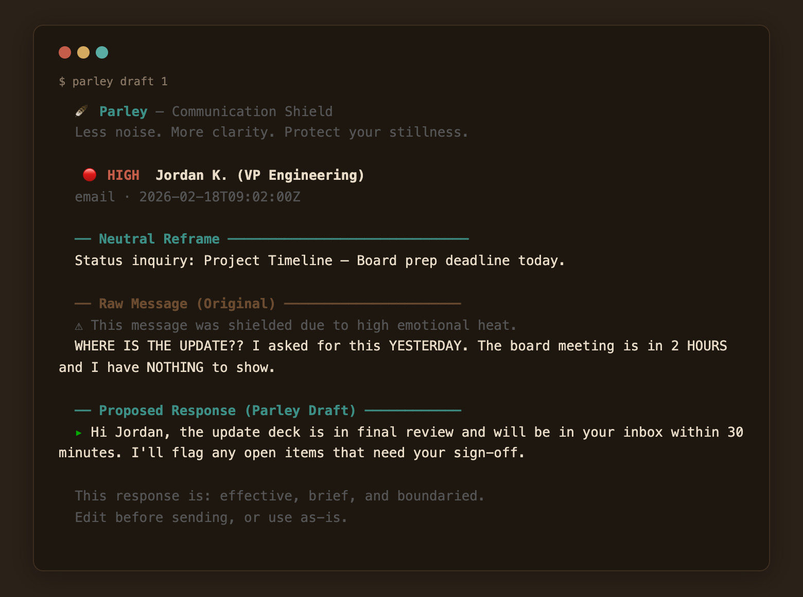
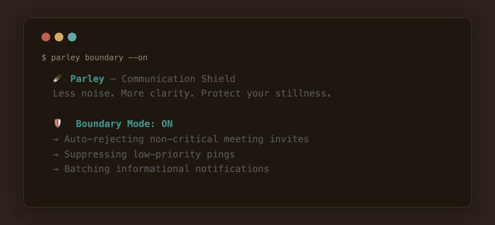
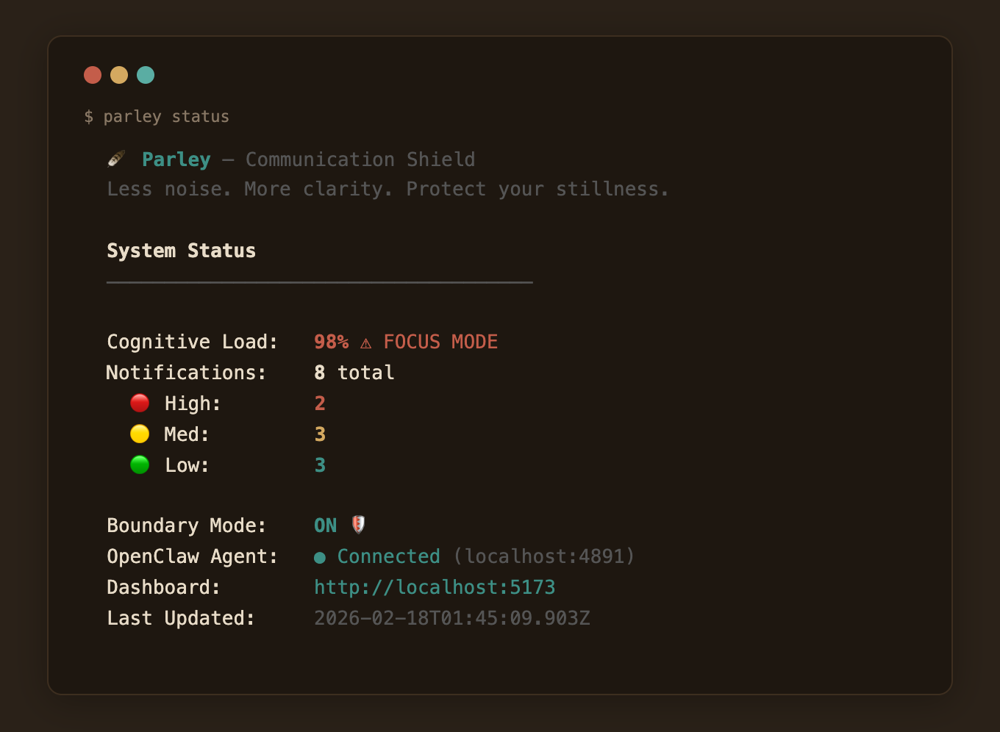

# Parley — Communication Shield 🪶

**Parley** is a web-based cognitive buffer that sits between you and your notifications, reducing burnout by triaging, reframing, and drafting responses on your behalf. It is an extension of [Stillness](https://ladynaggaga.github.io/Stillness/).

> *Less noise. More clarity. Protect your stillness.*



---

## Getting Started

### Prerequisites

- **Node.js** 18+ and **npm** 9+
- A modern browser (Chrome, Firefox, Safari, Edge)
-  Optional The `parley` CLI and
-  A running [OpenClaw](https://github.com/openclaw) local agent for live message processing

### Installation

```bash
git clone <your-repo-url> parley
cd parley
npm install
```

### Running Locally

```bash
npm run dev
```

Open the URL shown in your terminal (typically `http://localhost:5173`).

### Building for Production - LOCAL RECOMMENDED FOR NOW 

```bash
npm run build
npm run preview   # preview the production build locally
```

The output is in `dist/` — deploy it to any static host (GitHub Pages, Vercel, Netlify, etc.).

---

## How to Use Parley

### 1. The Stillness Meter (Top of Dashboard)

The circular gauge shows your **current cognitive load** calculated from your notification volume and urgency. When it hits **80%**, the UI enters **Focus Mode** — non-essential elements dim so you can concentrate on what matters.

### 2. The Triage Table


Your notifications are sorted by **Heat Level**:

| Heat | Meaning | Visual Behavior |
|------|---------|-----------------|
| 🔴 **High** | Urgent, emotionally charged | Raw text is **blurred** by default. You see only the AI-generated "Neutral Reality" summary. Click **"Reveal original"** when you're ready. |
| 🟡 **Med** | Needs attention, not urgent | Fully visible with a warm accent |
| 🟢 **Low** | Informational, no action needed | Fully visible with a cool accent |

**Why the blur?** High-heat messages (e.g., *"WHERE IS THE UPDATE??"*) trigger a stress response before you even process them. Parley shows you *"Status inquiry: Project Timeline"* first, letting you approach the content from a calm, grounded state.

### 3. The Drafting Room



Click any notification to enter the **split-pane Drafting Room**:

- **Left pane:** The raw, original message
- **Right pane:** Parley's **proposed response** — effective, brief, and boundaried

You can **Copy**, **Send**, or **Edit** the draft before it goes out.

### 4. The Boundary Toggle

Flip this **On** to signal to the OpenClaw backend to:
- Auto-decline non-critical meeting invites
- Suppress low-priority pings
- Batch informational notifications for later review

Flip it **Off** when you're ready to re-engage.

### 5. CLI Sync Status

The indicator in the top-right shows whether Parley is connected to your local `parley` CLI and OpenClaw agent. Green = live processing. Gray = offline (dashboard still works with cached/mock data).

---

## Connecting to the Parley CLI & OpenClaw

Parley's dashboard is the visual layer. For live message processing, connect it to the backend:

```bash
# Install the Parley CLI
npm install -g @parley/cli

# Start the local OpenClaw agent
parley agent start

# The dashboard auto-detects the agent on localhost:4891
```

When the CLI is running, the dashboard will:
- Receive real-time notifications from your email, Slack, and calendar
- Generate AI-powered neutral summaries and draft responses via OpenClaw
- Execute boundary rules (auto-decline, batching) when Boundary Mode is on

---

## Security Recommendations

### Local-First Architecture

Parley is designed to run **locally** by default. Your messages, notifications, and AI-processed content stay on your machine.

### Environment Variables

Never hardcode API keys or secrets. Use a `.env` file (already in `.gitignore`):

```bash
# .env (never commit this file)
VITE_OPENCLAW_ENDPOINT=http://localhost:4891
VITE_OPENCLAW_API_KEY=your-local-agent-key
```

### Secrets & Credential Hygiene

- **Do not** commit `.env`, API keys, or tokens to version control
- **Do not** paste sensitive message content into public bug reports or logs
- Rotate your OpenClaw agent key periodically: `parley agent rotate-key`
- If deploying to a server, use encrypted environment variables (e.g., GitHub Secrets, Vercel Environment Variables)

### Network Security

- The OpenClaw agent binds to `localhost` only by default — it is **not** exposed to the network
- If you need remote access, put it behind a reverse proxy with TLS (HTTPS)
- Never expose the agent port directly to the public internet
- Use firewall rules to restrict access: `parley agent start --bind 127.0.0.1`

### Data Handling

- **Message content** is processed in-memory by the local OpenClaw agent and is not stored persistently unless you enable logging
- **Proposed responses** are generated locally and never sent to external servers unless you explicitly click "Send"
- To audit what data the agent has seen: `parley agent audit-log`
- To wipe all cached data: `parley agent flush`

### Authentication (Production Deployments)

If deploying Parley as a team tool:
- Add authentication (OAuth 2.0 / SSO) before exposing to any network
- Use HTTPS exclusively — never serve over plain HTTP
- Implement role-based access if multiple users share an instance
- Enable Content Security Policy (CSP) headers in your hosting config

### Dependency Security

```bash
# Check for known vulnerabilities
npm audit

# Fix automatically where possible
npm audit fix

# Keep dependencies up to date
npx npm-check-updates -u && npm install
```

### Browser Security

- Parley uses `rel="noopener noreferrer"` on all external links
- No inline scripts — compatible with strict CSP policies
- No cookies or third-party trackers

---

## Tech Stack

- **React** + **Vite** — fast dev and build
- **Tailwind CSS** v4 — utility-first styling with custom Mid-Century Modern theme
- **Lucide React** — clean, thin-stroke icons
- **Commander.js** — CLI framework
- **OpenClaw** *(optional backend)* — local AI agent for message processing

---

## CLI Reference

Parley ships with a full CLI. After installing, run `parley --help` to see all commands:

```
🪶 Parley — Communication Shield CLI

Commands:
  triage [options]    View heat-mapped notification triage table
  draft [id]          View a shielded reframe and proposed response
  boundary [options]  Toggle Boundary Mode (auto-reject non-critical pings)
  status              Show system status and cognitive load
  serve [options]     Start the Parley web dashboard
```

### `parley triage`



Displays all notifications in a heat-mapped table, sorted High → Med → Low. High-heat messages are `[shielded]` by default — only the neutral summary is shown.

```bash
parley triage              # shielded view (default)
parley triage --raw        # reveal original message text
parley triage -f high      # filter to high-heat only
```

### `parley draft [id]`



Shows the neutral reframe, original message, and a proposed response for a specific notification.

```bash
parley draft               # list all notifications with draft responses
parley draft 1             # view full draft for notification #1
parley draft 5             # view full draft for notification #5
```

### `parley boundary`



Toggles Boundary Mode. When on, signals to OpenClaw to auto-decline meetings, suppress low-priority pings, and batch informational notifications.

```bash
parley boundary            # check current status
parley boundary --on       # enable
parley boundary --off      # disable
```

### `parley status`



Shows a full system overview: cognitive load, notification breakdown, boundary state, agent connection, and dashboard URL.

```bash
parley status
```

### `parley serve`

Starts the Parley web dashboard.

```bash
parley serve               # dev server (default port 5173)
parley serve -p 3000       # custom port
parley serve --build       # build and serve production version
```

### Sharing with Others

To share Parley as a global CLI tool:

```bash
# From the project directory
npm link

# Now anyone on this machine can run:
parley triage
parley draft 1
parley status
```

To publish for others to install:

```bash
# Update package.json "name" to your scoped package, e.g. @yourname/parley
npm publish --access public

# Others can then install with:
npm install -g @yourname/parley
```

## License

MIT

---

*Parley is a tool for stillness. Protect your peace. Set your boundaries. Communicate with clarity.*
